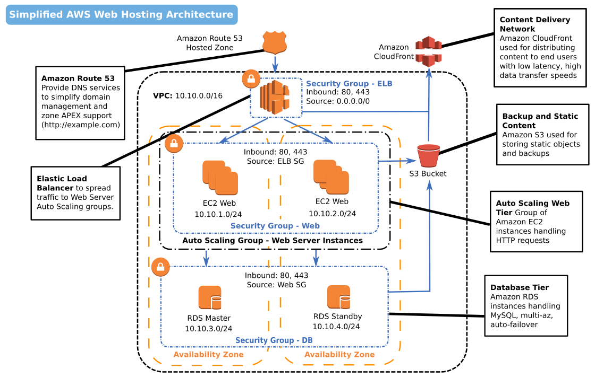

# Workshop: Web Hosting on AWS (Part 1)

## Overview

This workshop describes how to configure a web hosting environment on AWS. The workshop consists of two parts. Part 1 is dedicated to setting up the entire environment manually using the AWS Console in the web browser. The next session is focussed on deploying the same environment using CloudFormation and other automated tools.

## Target architecture



## Prerequisites:

* Create a new AWS account
* Login and select desired region
* Prepare IAM User / Role / Groups

### IAM Configuration

1. Enable MFA on root account
2. Create IAM User (generate security credentials)
3. Create IAM Group (Admin)
4. Attach Policy to Admin Group
5. Add User to Admin Group
6. Apply IAM Password Policy
7. Create IAM Role (S3-Access)
8. Attach Policy to Role (AmazonS3FullAccess)
9. Enable MFA on Admin Users

### SSH Key Pair

Generate an SSH key pair

## Networking (VPC)

* New VPC
	* Network CIDR: 10.10.0.0/16
* Web Subnets
  * A: 10.10.1.0/24; AZ: (ap-northeast-1a)
  * B: 10.10.2.0/24; AZ: (ap-northeast-1b)
  * C: 10.10.3.0/24; AZ: (ap-northeast-1c)
* DB Subnets
  * A: 10.10.4.0/24; AZ: (ap-northeast-1a)
  * B: 10.10.5.0/24; AZ: (ap-northeast-1b)
  * C: 10.10.6.0/24; AZ: (ap-northeast-1c)
* 3 Security Groups to new VPC
  * ELB-Security-Group
		* Inbound: 80, 443, 22; Source: 0.0.0.0/0
  * Web-Security-Group
		* Inbound: 80, 443; Source: `ELB-Security-Group` 
		* Inbound: 22; Source: 0.0.0.0/0 (for training only, never do this in production)
  * DB-Security-Group
		* Inbound: 3306, Source: `Web-Security-Group`

## Web Server Instances (EC2)

1x EC2 t2.micro Instance

* Instance Specification
	* Instance Type: t2.micro
  * Advanced Details:
    * User Data:
```php
#!/bin/bash
yum update -y
yum install -y httpd24 php56 mysql55-server php56-mysqlnd
service httpd start
chkconfig httpd on
groupadd www
usermod -a -G www ec2-user
chown -R root:www /var/www
chmod 2775 /var/www
find /var/www -type d -exec chmod 2775 {} +
find /var/www -type f -exec chmod 0664 {} +
echo "<?php phpinfo(); ?>" > /var/www/html/phpinfo.php
```
  * Instance Details
		* Number of Instances: 1
    * Network: New VPC - 10.10.0.0/16
    * Subnet: No Preference 
    * Auto-Assign Public IP: Enable
    * IAM Role: `S3-Access`
  * Tags
		* Name: websitecom
    * Stack: awsug-tutorial
    * Environment: dev
  * Security Group: `Web-Security-Group`
	
### MySQL Database Instances (RDS)

1x MySQL db.t2.micro Instance

* DB Subnet Group
	* Name: websitecom-dbsg
	* Add all AZ - Subnet pairs

* Instance Specifications
  * DB Instance Class: db.t2.micro
	* Multi-AZ: No
  * Storage Type: Generate Purpose (SSD)
  * Allocated Storage: 5 GB
* Settings
  * DB Instance Identifier: websitecom-wordpress
  * Master Username: wordpressdb
  * Master Password: wordpressdb
* Network & Security
  * VPC: New VPC from above
  * Subnet Group: `websitecom-dbsg`
  * Publicly Accessible: No
  * Availability Zone: No Preference
  * VPC Security Group: db-security-group
* Database Options
  * Database Name: wordpress
  * Database Port: 3306
  * DB Parameter Group: default-mysql-*
  * Option Group: `default-mysql-*`
* Backup (keep defaults)
  * Backup Retention Period: 7 days
  * Backup Window: No Preference
  * Auto Minor Version Upgrade: Yes
  * Maintenance Window: No Preference
* Tags
	* Name: websitecom-mysql
	* Stack: awsug-tutorial
	* Environment: dev

### Elastic Load Balancer

1x ELB

* Create Load Balancer
  * Load Balanacer name: mysite.com-lb
  * Create LB Inside: New VPC from above
  * Create an internal load balancer: unchecked
  * Enable advanced VPC configuration: unchecked
  * Listener Configuration:
    * Load Balancer: HTTP (80), Instance: HTTP (80) 
    * Load Balancer: HTTPS (443), Instance: HTTPS (443) 
  * Configure Health Check
    * Ping Protocol: HTTP
    * Ping Port: 80
    * Ping Path: /index.html
 		* Advanced Details (leave defaults)
      * Response Timeout: 5
      * Health Check Interval: 30
      * Unhealthy Threshold: 4 
      * Healthy Threshold: 4 (up within 2min) 
  * Assign Security Groups: web-dmz
  * Tags
    * Name: websitecom-lb
		* Stack: awsug-tutorial
		* Environment: dev

## Create S3 Bucket

2x S3 Buckets

	* websitecom-deployment
  * websitecom-prod

# More next time...

Part 2 will cover Auto Scaling, CloudFormation, CloudFront, and Route 53.
